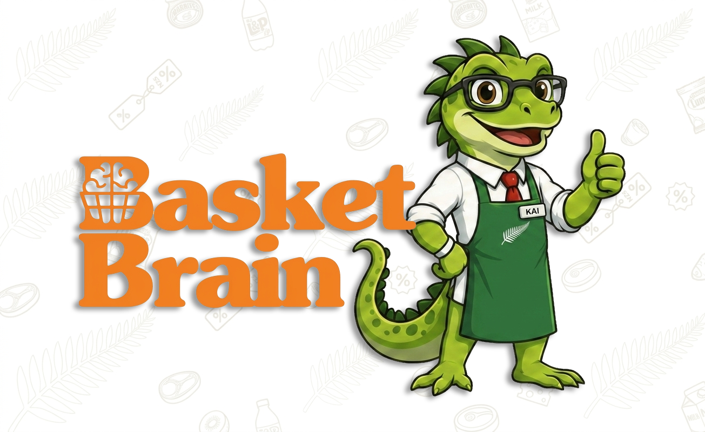
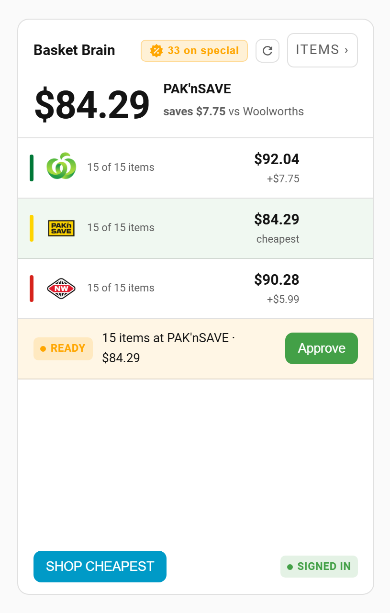
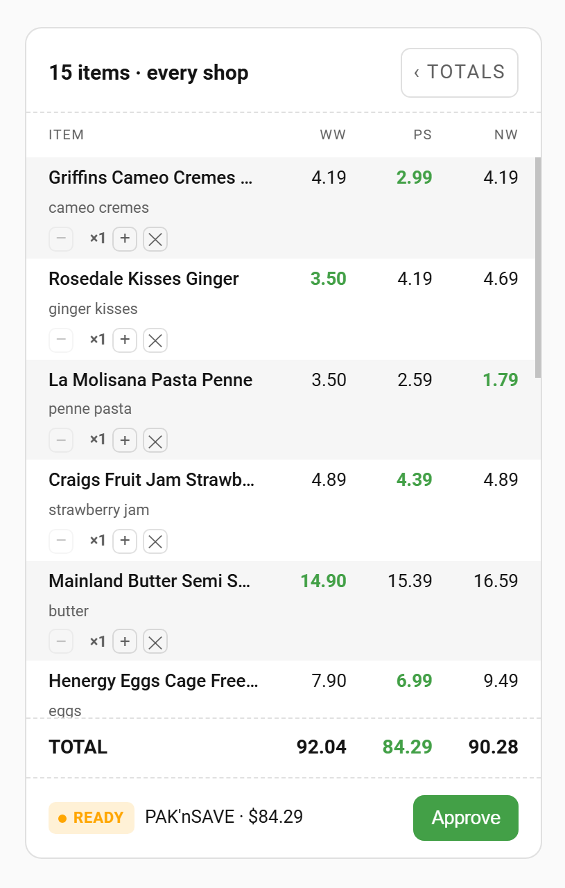
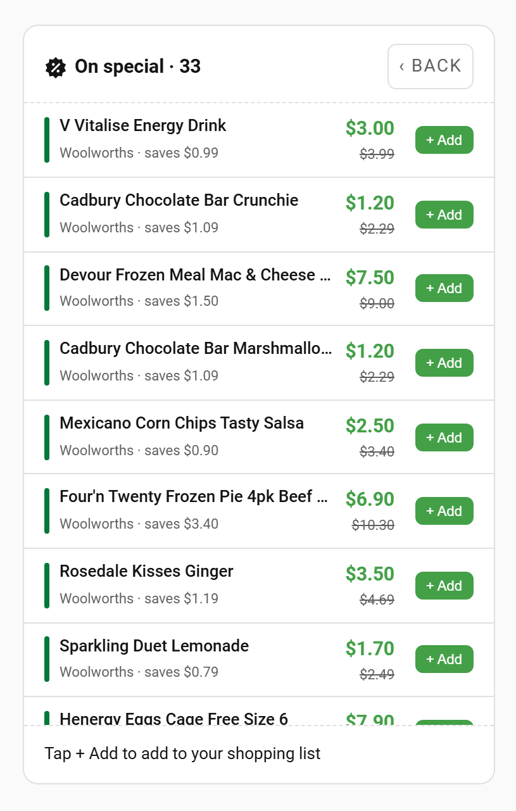

<div align="center">



# Basket Brain

**A Home Assistant integration that tracks the local supermarket price wars so you don't have to.**

[](https://github.com/hacs/integration)
[](LICENSE)
[](https://github.com/letitbe-dull/basket-brain/stargazers)
[](https://github.com/letitbe-dull/basket-brain/issues)
[](https://buymeacoffee.com/letitbedull)

[What it does](#what-it-does) · [How it works](#how-it-works) · [Installation](#installation) · [Lovelace card](#lovelace-card) · [Sensors](#sensors) · [Services](#services) · [Roadmap](#roadmap) · [Report a bug](https://github.com/letitbe-dull/basket-brain/issues/new)

</div>

---

## Why this exists

Grocery shopping in New Zealand's a bit of a racket. You pick up a block of butter at Woolworths for nine bucks, then spot it at seven in PAK'nSAVE a few days later, and it nags at you. Nobody's got the patience to sit with three browser tabs open matching a shopping list item by item.

Basket Brain does the boring part for you. It pulls your Home Assistant shopping list (yes, including the things you yell at Alexa from the kitchen), matches your 'mulk' to the milk you actually buy, compares the total across the three main chains, and builds the cheapest cart ready to buy.

## What it does

* **The big three:** Compare live prices at Woolworths, PAK'nSAVE, and New World.
* **Alexa play nice:** Syncs your native Home Assistant shopping list. You don't need a Nabu Casa subscription to make Alexa work with it.
* **Proper matching:** Maps your Home Assistant list to real products. It checks your history first, looks for pinned aliases, and falls back to a live search.
* **Builds the cart:** Puts the cheapest cart together with one click. It pushes the whole lot to your online account, ready for checkout.
* **Specials alerts:** Tracks what you buy and lets you know when a bottle of V is cheaper than petrol.
* **Lovelace card:** A custom card. The front compares totals across the big three; flip it over for individual item prices.
* **Lightweight HA:** The headless Firefox needed to get past supermarket bot blockers lives in a sidecar add-on. The integration itself sticks to light API calls.
* **Store finder:** Picks your local stores from your home coordinates. Closest ones show up first.

## How it works

Getting data out of NZ supermarkets is fiddly, because their websites run strict bot blockers. Here's the way around it:

1. **The Login Companion:** The add-on runs a hidden Firefox browser using Camoufox. It signs in, grabs the cookies, and hands them over.
2. **Cookie Rotation:** Once we have those cookies, the integration uses simple web requests. It saves updates to disk, so we don't have to boot up Firefox again.
3. **Product Matching:** It checks your pinned items and past purchases first before searching the store databases.

> [!WARNING]
> **Warning: CPU spike during login**
> Firefox takes a lot of juice. When the companion signs in, it'll peg one CPU core near 100% for about 30 seconds per supermarket. If you've enabled the three chains, that's a solid minute and a half of heavy lifting when Home Assistant starts or once a day. If you're running this on a Raspberry Pi, it's going to take longer. Between logins, it sits quietly using almost no CPU and about 60 MB of RAM.

## Installation

> [!IMPORTANT]
> Requires Home Assistant OS or Supervised. The login companion is an add-on, and Container and Core installs can't run add-ons.

Install the add-on first. The integration looks for it during setup and won't finish without it.

### 1. Install the login add-on

[](https://my.home-assistant.io/redirect/supervisor_addon/?addon=9020f6f4_basket_brain_login&repository_url=https%3A%2F%2Fgithub.com%2Fletitbe-dull%2Fbasket-brain)

That button adds the repository and opens the add-on in one go. Click **Install**, then **Start**.

<details>
<summary>Doing it by hand instead</summary>

1. Go to **Settings → Add-ons → Add-on Store**.
2. Click the three dots top-right and select **Repositories**.
3. Paste `https://github.com/letitbe-dull/basket-brain` and click **Add**.
4. Close the dialog, find **Basket Brain Login**, and click **Install**.
5. Start the add-on.

</details>

### 2. Download the integration through HACS

[](https://my.home-assistant.io/redirect/hacs_repository/?owner=letitbe-dull&repository=basket-brain&category=integration)

<details>
<summary>Doing it by hand instead</summary>

1. Open **HACS**.
2. Click the three dots top-right, then **Custom repositories**.
3. Paste `https://github.com/letitbe-dull/basket-brain`, choose **Integration** as the category, and click **Add**.
4. Find **Basket Brain** and download it.

</details>

Restart Home Assistant once it's downloaded.

### 3. Add the integration

[](https://my.home-assistant.io/redirect/config_flow_start/?domain=basket_brain)

Then follow the prompts:

* Enter your Woolworths and Foodstuffs details (New World and PAK'nSAVE share the same login).
* Pick which chains you want to track.
* Choose your local stores. We'll show the closest ones first using your home coordinates.

On first setup the integration generates a secret, hands it to the add-on, and restarts it, so the add-on is the only thing on your system that can be asked to log in as you. That first start takes a little longer because of the restart. It only happens once.

<details>
<summary>Doing it by hand instead</summary>

Go to **Settings → Devices & Services → Add Integration**, then search for **Basket Brain**.

</details>

## Lovelace card

The integration registers its own custom card. You don't need to add it to your resources manually.

After first setup, refresh your browser (Ctrl+F5) so the card shows up in the card picker.

Add through the card picker or add custom yaml:

```yaml
type: custom:basket-brain-card
```

There are three sides to it. Click anywhere that isn't a button to flip.

| Totals | Items | Specials |
|---|---|---|
|  |  |  |
| Cheapest chain higlighted, then what the same list costs everywhere else, your login status, and any cart waiting on your approval. | Your list line by line, with what each item costs at each chain. Handy for spotting where the difference comes from. | Things you buy regularly that happen to be cheap this week, on your list or not. |

## Sensors

You get these sensors out of the box:

| Entity ID | State | Key Attributes | Description |
|---|---|---|---|
| `sensor.basket_total_woolworths` | NZD Total | None | Total cost of your list at Woolworths. |
| `sensor.basket_total_paknsave` | NZD Total | None | Total cost of your list at PAK'nSAVE. |
| `sensor.basket_total_newworld` | NZD Total | None | Total cost of your list at New World. |
| `sensor.shopping_list` | Item count | `items[]` | Your active list, showing the best match and price for each store. |
| `sensor.items_woolworths` | Priced count | `items[]` | How many of your items were found at Woolworths. |
| `sensor.items_paknsave` | Priced count | `items[]` | How many of your items were found at PAK'nSAVE. |
| `sensor.items_newworld` | Priced count | `items[]` | How many of your items were found at New World. |
| `sensor.pending_cart` | Chain name / `none` | `total_nzd`, `items[]`, `out_of_stock[]` | Details of a cart we've put together that's waiting for you to approve it. |
| `sensor.specials_alerts` | Specials count | `items[]` | Number of items you buy often that are currently on special. |
| `binary_sensor.login_<chain>_signed_in` | `on` / `off` | None | Whether we have a working cookie jar for the chain. |

## Services

| Service Name | Description | Fields / Parameters |
|---|---|---|
| `basket_brain.pin_alias` | Pin a specific shopping list phrase to a product ID. | `phrase`, `chain`, `product_id` |
| `basket_brain.set_quantity` | Change how many of an item you want to buy (doesn't change your HA todo list). | `phrase`, `quantity` |
| `basket_brain.build_cheapest_cart` | Finds the cheapest store, stages the cart, and pings you for approval. | None |
| `basket_brain.build_cart` | Stages the cart at a specific supermarket and pings you. | `chain` |
| `basket_brain.approve_cart` | Pushes the staged cart straight to your live online trolley. | None |
| `basket_brain.schedule_build` | Saves a daily time (24h format) to build your cart automatically. | `time` |
| `basket_brain.approve_resolution` | Tells the matcher it got a low-confidence item right, so it remembers next time. | `phrase`, `chain` |
| `basket_brain.relogin` | Forces a browser login to get fresh cookies. | `chain` (optional) |
| `basket_brain.rebuild_map` | Rebuilds the local barcode-to-product mapping from your history. | None |

## Roadmap

Ideas kicking around, in no particular order. No promises on timing.

* **Delivery and pick-up slots:** Show the next available slot at each store, so the cheapest basket isn't the one you can't collect until Thursday.
* **Split the shop:** Mix and match across more than one supermarket when the savings are worth a second stop.
* **More chains:** Fresh Choice and Paddock to Pantry.

If one of these matters to you, say so in an issue. It helps to know what people actually want.

## Contributions

PRs welcome. Open an issue first if it's a big one.

> [!NOTE]
> **Where it's likely to break on you**
>
> **Login.** The supermarkets aren't keen on us being here and they change their API whenever they feel like it. If something stops working check the add-on logs first, and stick them in an issue if you can't sort it.
>
> **Matching items between stores.** Turns out "milk 2L" being the same thing at all three chains is a much harder problem than I thought. Different names, different sizes, different barcodes, same product. It mostly works, then picks a random brand of tinned tomatoes. Pin an alias to fix it on your end, and let me know so I can fix the matching properly.

## License

[MIT](LICENSE)

---

<div align="center">
<sub>Not affiliated with or endorsed by Woolworths NZ or Foodstuffs. Your logins and your list stay on your own box. It automates your own account rather than scraping, but it's your account under their terms, so use at your own risk.</sub>
</div>
